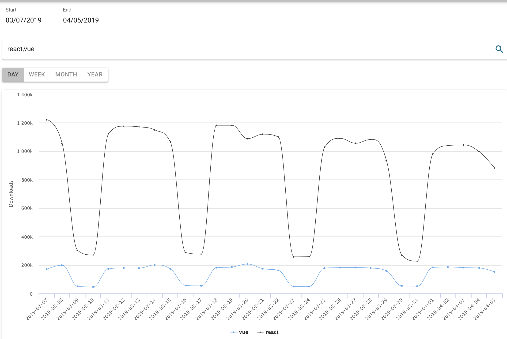
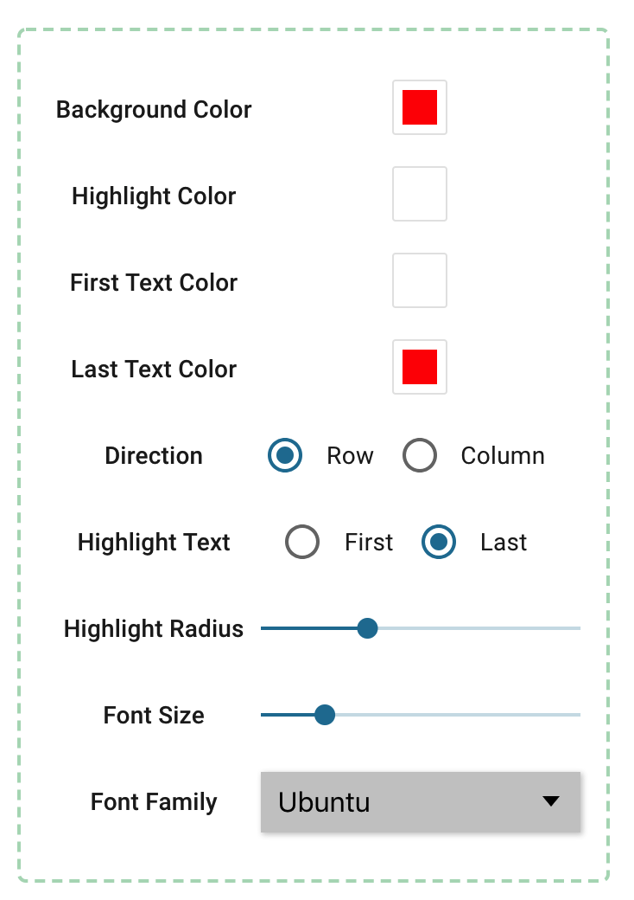

## Tools

[Click here](https://tools.waningflow.com/) to view the website.

Usually there are several tools I like to use. Someday I want to combine them in one site thus I make "Tools". 

For now, there are only two tools in the site. But don't worry, more tools are coming. If you have any interesting ideas or requirements, feel free to raise an issue and I'll consider to add the functionality.

__Tools Menu__

 - [_NPM Downloads_](#NPM-Downloads)
 - [_Logo Generator_](#Logo-Generator)

### NPM Downloads 
[Link](https://tools.waningflow.com/npm-download)

Search for the downloads statistic of NPM packages.

Input the date and the package names to get the downloads statistic.
All the data come from the api of NPM downloads.

### Logo Generator
[Link](https://tools.waningflow.com/logo-generate)

Generate logo like YouTube.

And you can also adjust many parameters to get the best appearance you want.

Finally export the logo as PNG.